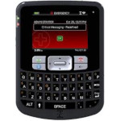

# Zipit Z3

  
|Component|Description                            |
|---------|---------------------------------------|
|CPU      |Analog Devices ADSP-BF524BBCZ-4A 400MHz|
|RAM      |64MB                                   |
|Storage  |128MB                                  |
|Screen   |2.4" 320x240                           |
|Keyboard |QWERTY                                 |
|WLAN     |Wi-Fi 802.11 b/g                       |
|Battery  |3.7V 1280mA                            |
|Dimension|78mm x 108mm x 18mm                    |
|Weight   |300g                                   |

### https://steward-fu.github.io/website/index.htm
